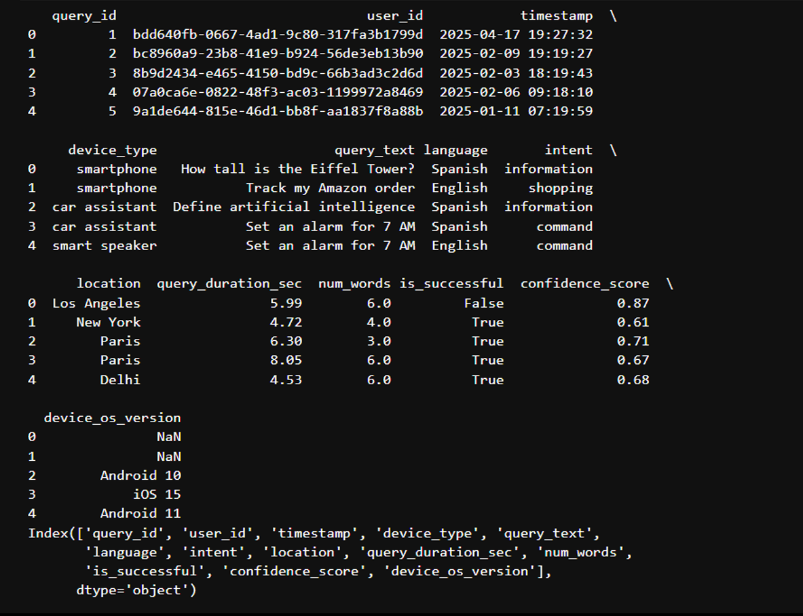
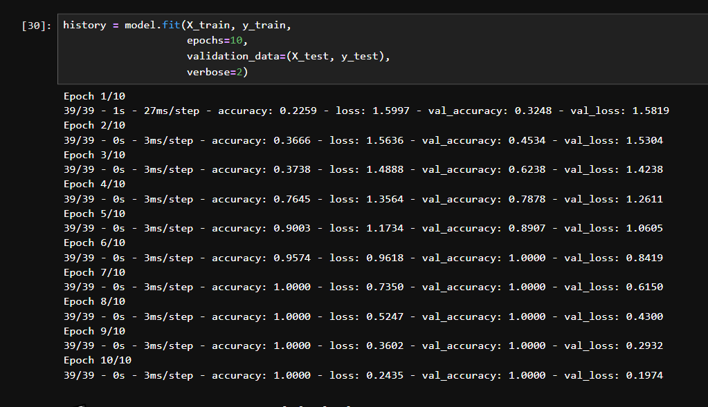
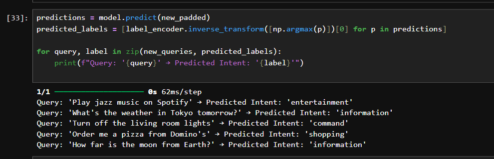
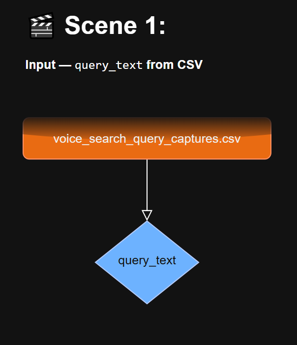
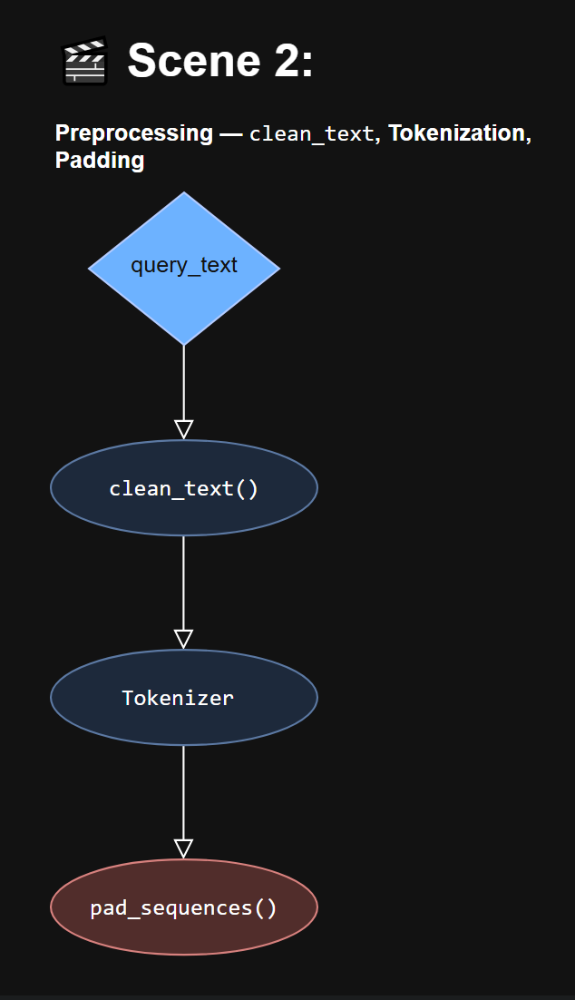
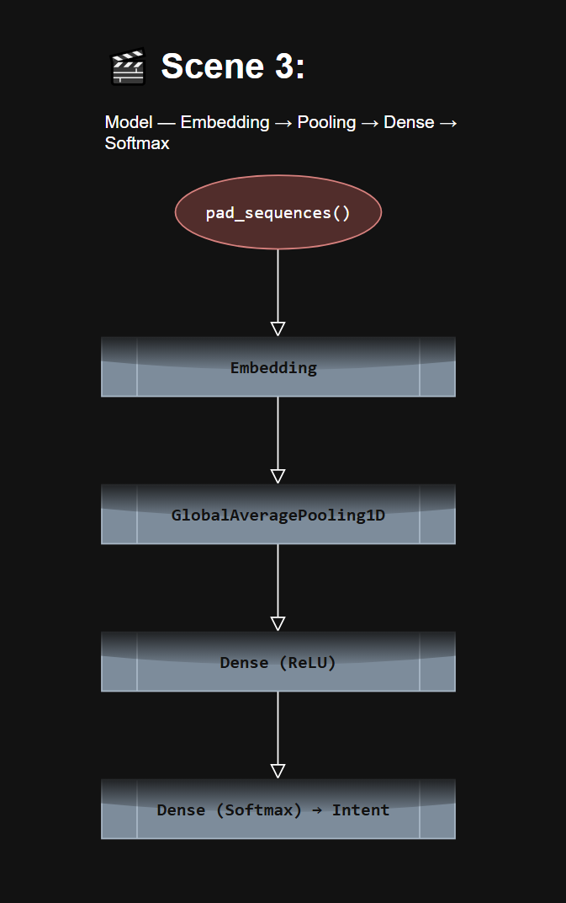
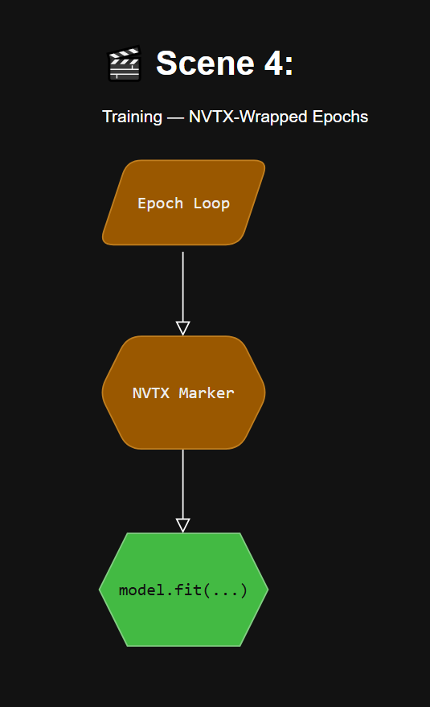
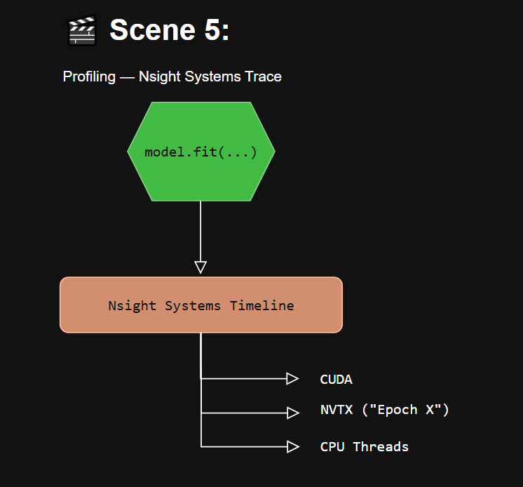
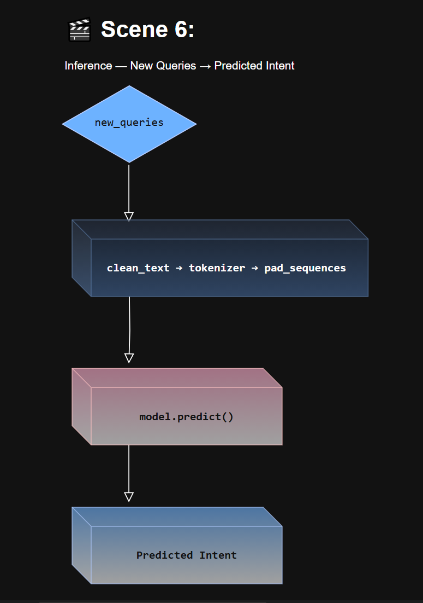
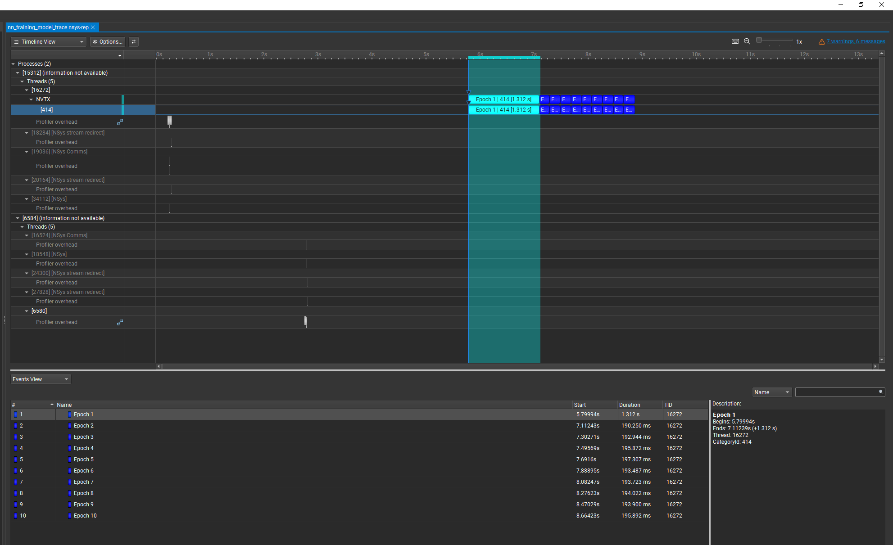

# 🎙️ Voice Search Intent Classifier (with GPU Profiling Lab)

This project trains an artificial neural network to classify voice search queries by intent—such as `information`, `command`, `shopping`, or `entertainment`. Built for clarity, modularity, and performance, the lab includes full GPU profiling using NVIDIA Nsight Systems and NVTX markers.

---


---

## 🚀 Project Structure

ml-training-lab/ 
├── train_model.py    # Training script with NVTX profiling 
├── predict_intent.py # Inference script for new voice queries 
├── utils.py          # Shared preprocessing and encoding functions 
├── traces/           # Nsight Systems .nsys-rep files 
└── README.md         # Project overview and instructions


---

## 🧠 What This Project Demonstrates

- ✅ Real-world NLP pipeline using voice search data
- ✅ Intent classification with TensorFlow/Keras
- ✅ Modular design for training, inference, and preprocessing
- ✅ GPU profiling with Nsight Systems + NVTX annotations
- ✅ Interview-ready explanations of model behavior and performance

---

## 📊 Dataset

- **Source**: `voice_search_query_captures.csv`
- **Fields used**:
  - `query_text`: Input to the model
  - `intent`: Target label
- **Preprocessing**:
  - Lowercasing, punctuation removal
  - Tokenization + padding
  - Label encoding



---

## 🧪 Model Architecture

- `Embedding` layer (vocab size: 1000, dim: 16)
- `GlobalAveragePooling1D`
- `Dense` (24 units, ReLU)
- `Dense` (softmax output for multi-class classification)




---

## 🧭 Architecture Overview








--- 

## 🔍 Profiling with Nsight Systems

Training is wrapped with NVTX markers for each epoch:

```python
with nvtx.annotate("Epoch 1", color="blue"):
    model.fit(...)
```
---

### To generate a trace:
nsys profile -o traces/nn_training_trace --trace=cuda,nvtx python train_model.py


### Open the .nsys-rep file in Nsight Systems to visualize:
* CUDA kernel launches
* Memory transfers
* NVTX-labeled epochs
* CPU orchestration




### 🔮 Inference Example
python predict_intent.py

### Sample output:
Query: 'Play jazz music on Spotify' → Predicted Intent: 'entertainment'
Query: 'Turn off the living room lights' → Predicted Intent: 'command'

---

## 🧰 Requirements
* Python 3.8+
* TensorFlow
* scikit-learn
* NVIDIA Nsight Systems
* NVTX (pip install nvtx)

---

## 🎯 Future Enhancements
* Add confusion matrix and intent distribution visualizations
* Integrate real-time voice input via microphone
* Expand to multilingual intent classification
* Profile inference latency and memory footprint

---

## 🧠 Author
Dartayous — Creative Technologist & AI/ML Engineer 
Focused on cinematic, modular GPU workflows and explainable AI. 
Built this lab to showcase real-world ML engineering and profiling mastery.

---

## 📎 License
MIT License — feel free to fork, remix, and build upon it.